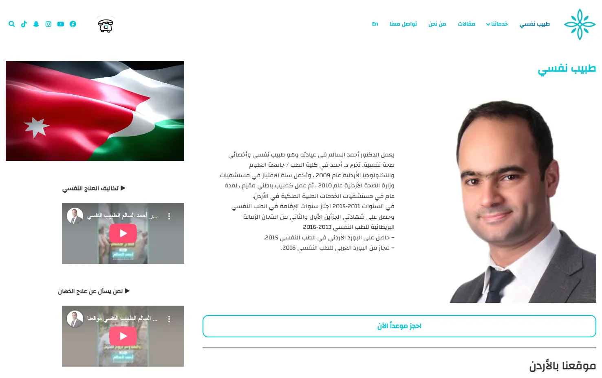

---

# Dr Ahmed Salem Clinic

Production Case Study

Fully responsive bilingual (Arabic / English) mental health and psychology website built for a licensed psychologist in Jordan, focusing on trust, accessibility, and professional presentation of services.

---

## 📑 Table of Contents

- [🚀 Project Overview](#-project-overview)
- [✨ Key Features](#-key-features)
- [🧠 Website Structure](#-website-structure)
- [🧳 Technologies](#-technologies)
- [📸 Screenshots](#-screenshots)
- [🌍 Live Website](#-live-website)
- [📌 Project Information](#-project-information)
- [📈 Project Impact](#-project-impact)
- [🔒 Source Code](#-source-code)
- [📬 Contact Information](#-contact-information)

---

## 🚀 Project Overview

This project is a professional WordPress-based website developed for a licensed psychiatrist in Jordan.

The main objective was to build a modern, trustworthy, and easy-to-navigate platform that presents psychological services, programs, articles, and consultation booking in a clear and accessible way for both Arabic and English users.

The website was designed with a strong focus on user experience, credibility, and bilingual accessibility while maintaining a clean medical and professional identity.

---

## ✨ Key Features

- Fully responsive design across all devices
- Bilingual support (Arabic / English)
- RTL optimized layout for Arabic content
- Professional service presentation structure
- Dedicated pages for services, blog, and programs
- Online consultation booking system
- WhatsApp direct contact integration
- Google Maps integration for clinic location
- SEO-optimized structure using Yoast SEO
- Secure contact forms with WPForms
- Fast-loading optimized WordPress theme
- Structured content for better readability and trust building
- Media-rich blog system for psychological awareness content

---

## 🧠 Website Structure

### Main Pages

- Home
- About the Doctor
- Smiling Horizon Men
- Smiling Horizon Women
- Free Workshops
- Iron Man 60
- Articles
- Contact

### Specialized Sections

- Psychological Therapy Programs
- Mental Health Awareness Articles
- Consultation Services
- Patient Guidance Pages

---

## 🧳 Technologies

- WordPress
- HTML5
- CSS3
- JavaScript
- Yoast SEO
- WPForms
- Google Maps Integration
- WhatsApp API Integration

---

## 📸 Screenshots

### Homepage

---

## 🌍 Live Website

https://drahmadsalem.com

👉 View full case study on my website:  
https://mahmoudabuyoussef.com/projects/dr-ahmed-salem-clinic

---

## 📌 Project Information

| Field        | Details                      |
| ------------ | ---------------------------- |
| Project Type | Medical / Psychological Site |
| Industry     | Healthcare / Mental Health   |
| Role         | WordPress Developer          |
| Duration     | 1 Week                       |
| Status       | Production                   |
| Year         | 2024                         |

---

## 📈 Project Impact

- Improved online presence for clinic services
- Increased patient inquiries through website
- Enhanced trust and credibility of the doctor’s brand
- Simplified appointment booking process
- Improved accessibility for Arabic and English users
- Better SEO visibility in local search results
- Stronger digital identity for mental health services

---

## 🔒 Source Code

This project was developed for a real production environment.

The source code is private and not publicly available due to client and production restrictions.

This repository is intended for project presentation and case study purposes only.

---

## 📬 Contact Information

If you'd like to collaborate, discuss a project, or hire me for development work:

- 📧 Email: contact@mahmoudabuyoussef.com
- 💼 LinkedIn: https://www.linkedin.com/in/mahmoudabuyoussef
- 🌐 website: https://mahmoudabuyoussef.com
- 🐙 GitHub: https://github.com/mahmoud-abuyoussef
